## ColdBox-VM

У браузері відкриваємо http://192.168.56.106 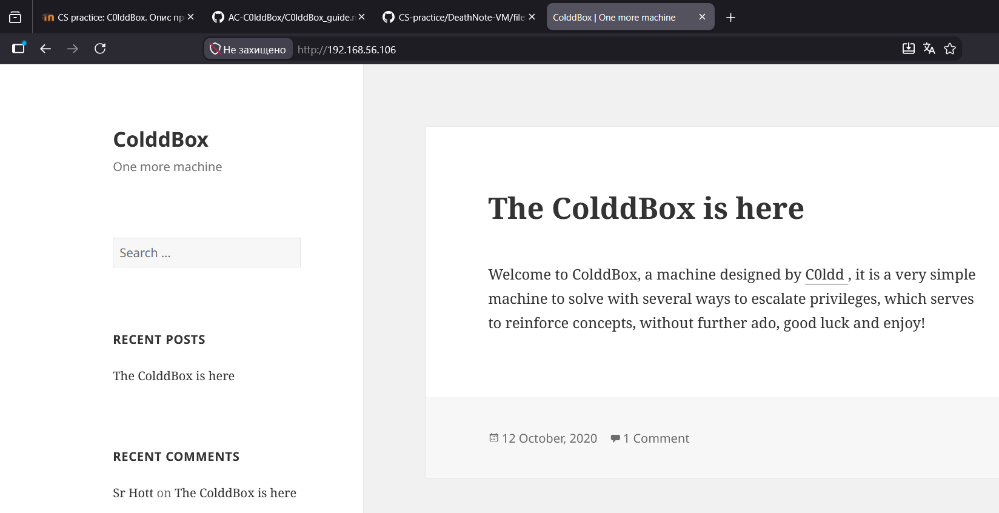

Скануємо 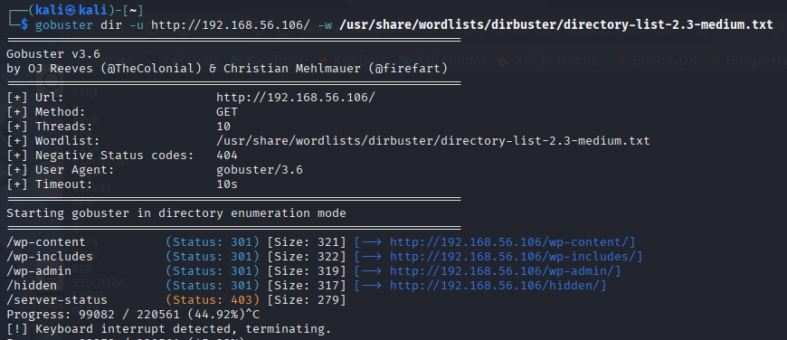

Дізнаємося про трьох користувачів 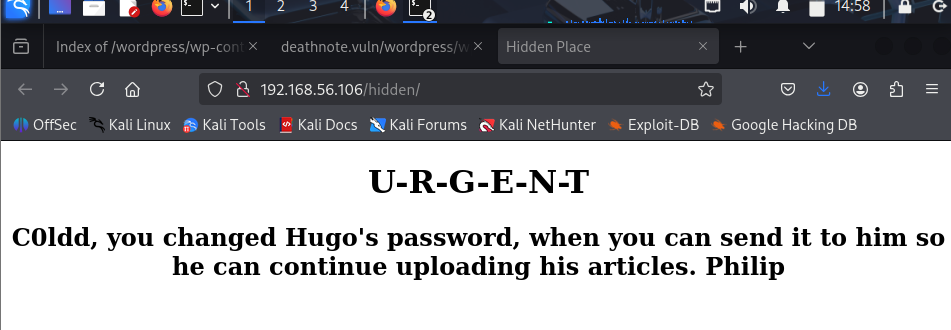

Запускаємо брутфорс
`wpscan --url http://192.168.56.106/ -U c0ldd -P /usr/share/wordlists/rockyou.txt`
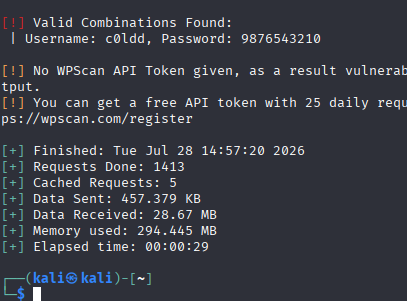

Входимо у wordpress 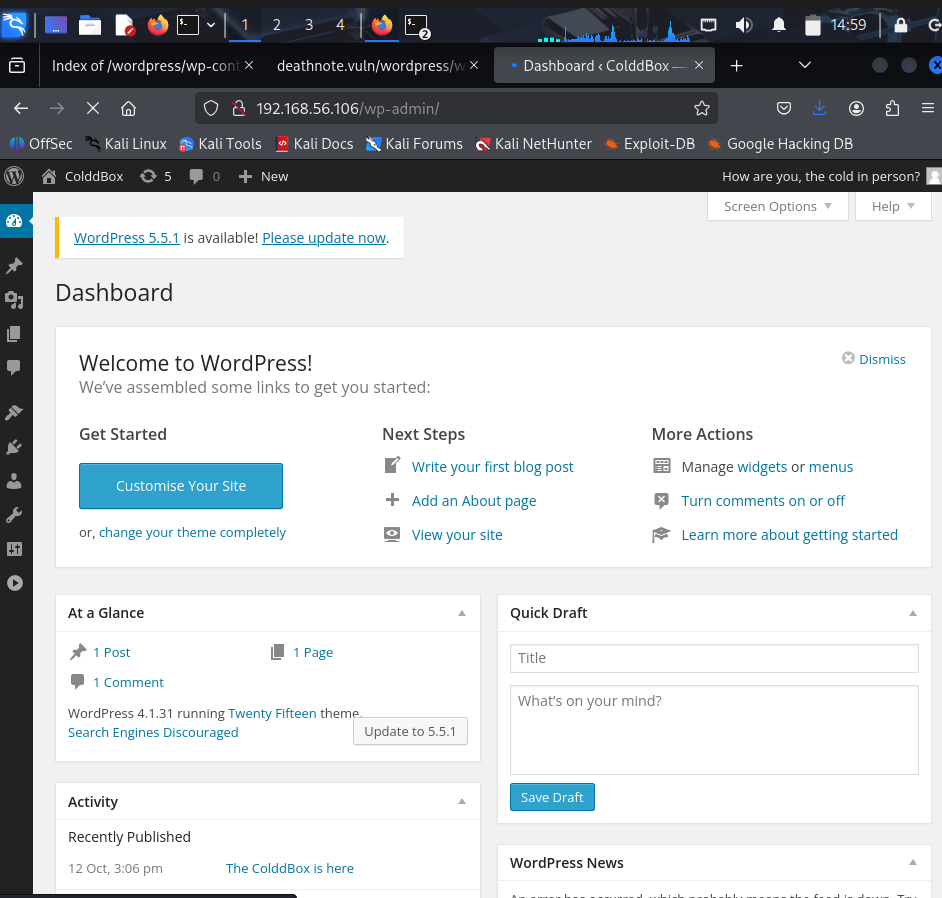

Замінюємо footer.php у редакторі тем на php reverse shell 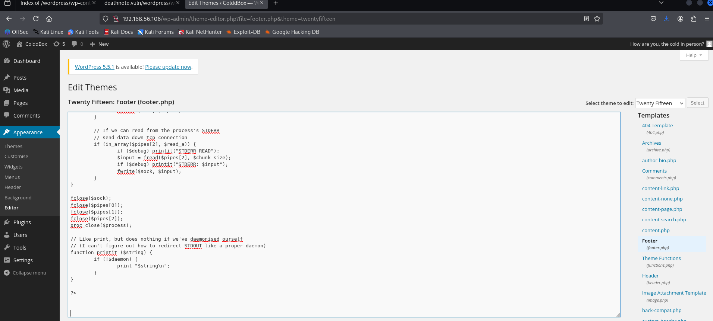

Виконуємо команду `nc -lvnp 3421`

Після оновлення головної сторінки, отримуємо підключення 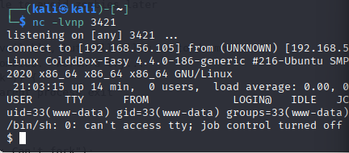

У файлі wp-config.php бачимо комбінацію користувача та паролю 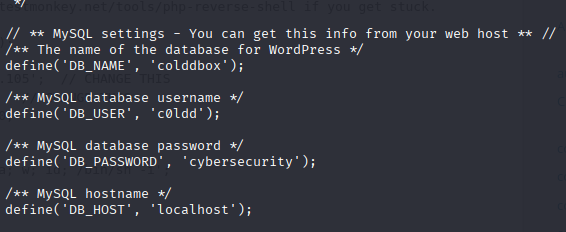

Спробуємо зайти в сисетму під користовачем "c0dd" зі знайденим паролем: 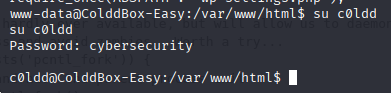

У домашньому каталозі лежить файл user.txt 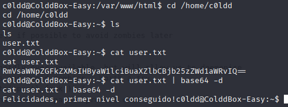

Визначимо, які саме повноваження є за допомогою команди: 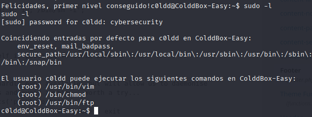 Ми можемо підвищити свої привілеї до root, використовуючи будь-яку з цих трьох команд

Використаємо vim

Запускаємо vim за допомогою sudo
`sudo vim -c ':!/bin/sh'`

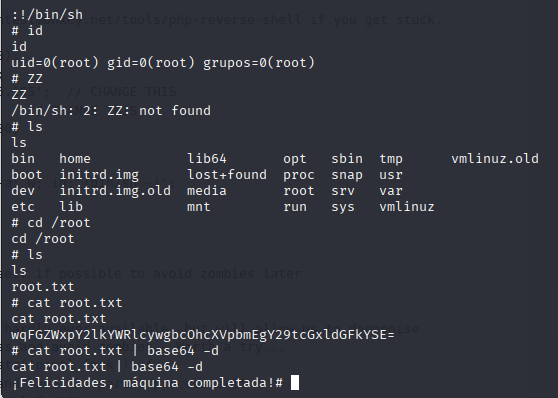