## DeathNote-VM

На машині розгорнутий веб сервіс на порту 80 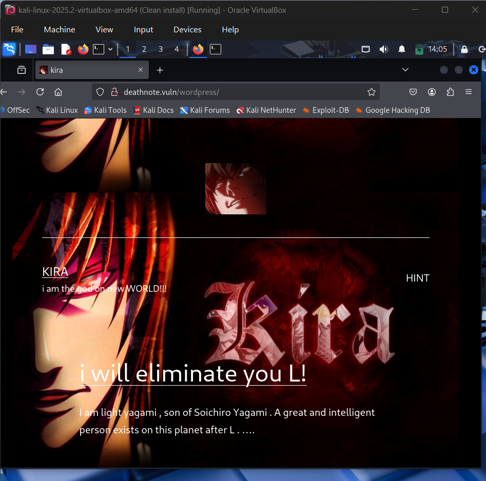

Скануємо командою `dirsearch -u http://deathnote.vuln/` 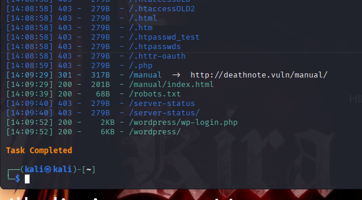

В robots.txt бачимо файл important.jpg 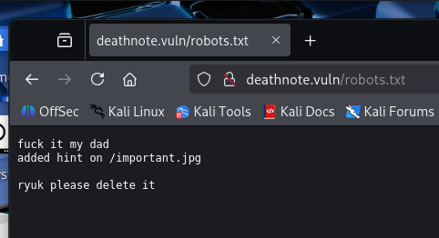

Виконавши команду curl, отримуємо наступну підказку 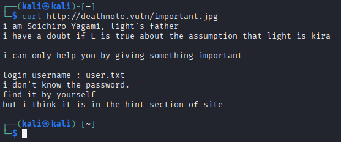

Шлях до каталогу, де знаходяться файли user.txt і notes.txt є в коді сторінки 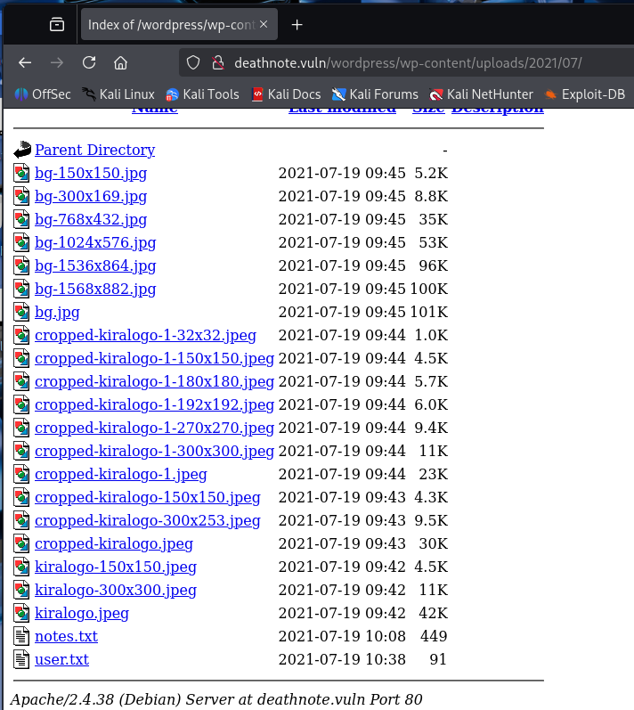

Використаємо їх для атаки методом підбору 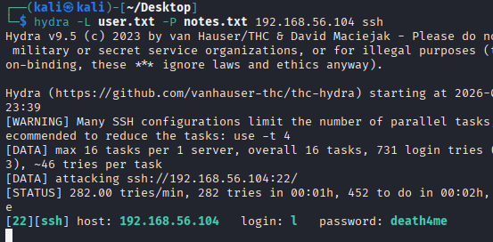

В домашньому каталозі знаходимо user.txt 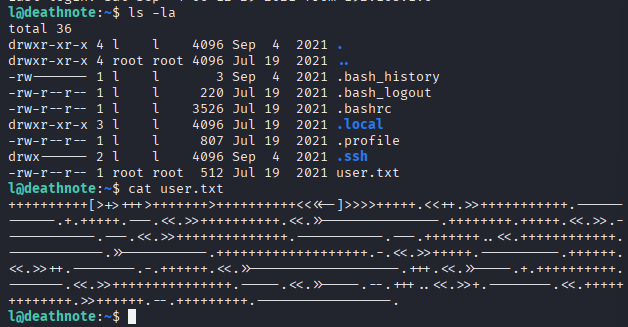
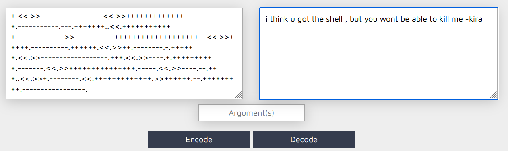

Шукаємо по всієї файловій системі файли та директорії, які мають в назві "kira":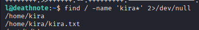

Наступна підказка у файлі case.wav 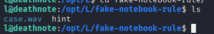

Декодуємо hex та base64 і отримуємо passwd : kiraisevil

Входимо під користувачем kira, який має права суперкористувача 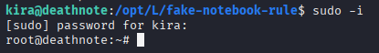

Виводимо root.txt 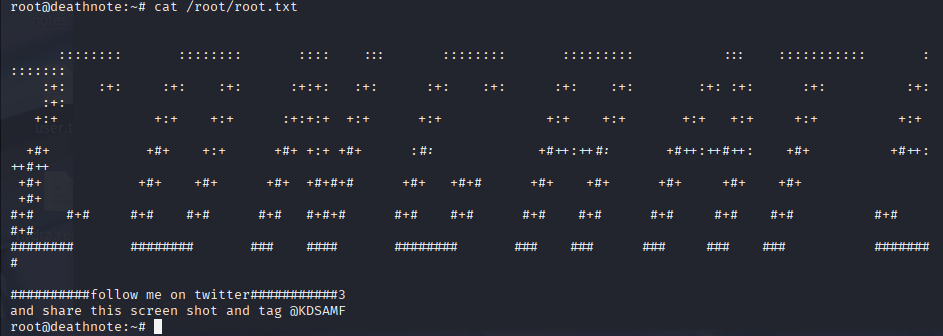