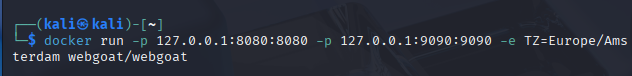
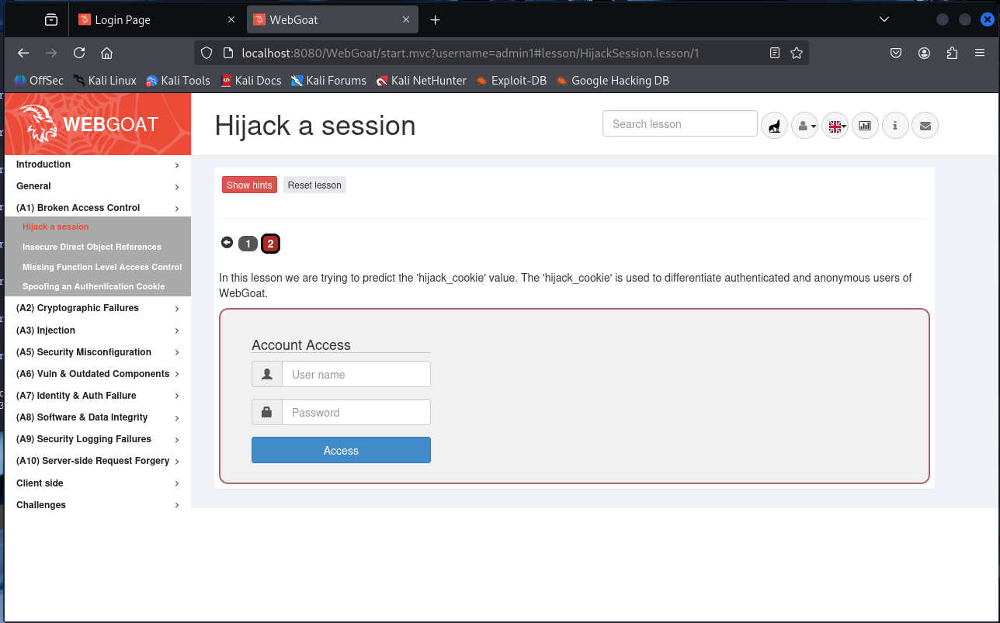
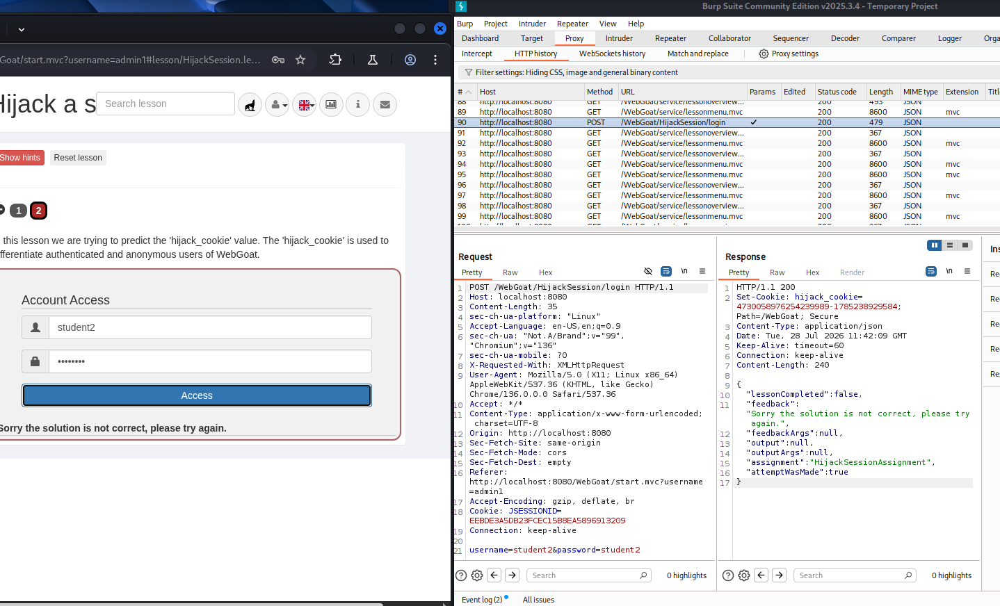
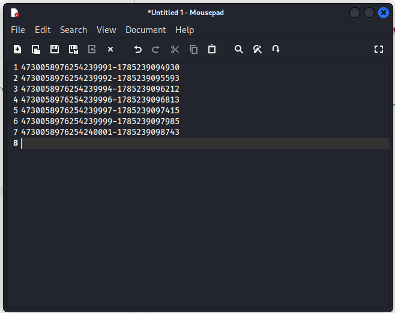
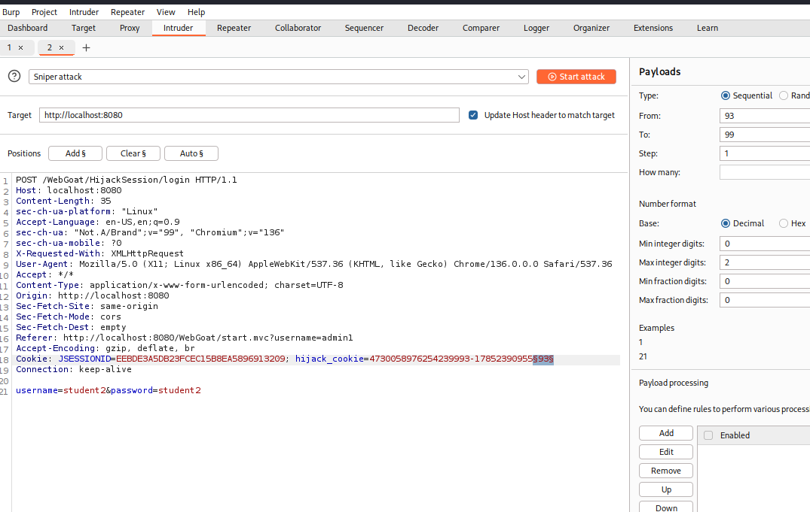
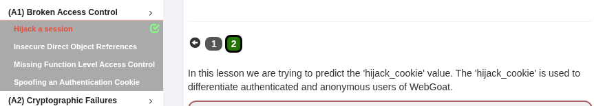

# WebGoat: Hijack a session

Запускаємо контейнер WebGoat за допомогою Docker: 

У меню WebGoat відкриваємо вкладку Hijack a session 

За допомогою Burp Suite перехоплюємо невдалу спробу входу користувача 

У відповіді сервера бачимо значення `hijack_cookie` 

Використовуємо Burp Suite Intruder для підбору правильного значення `hijack_cookie` 

Завдання пройдено! 