DOM XSS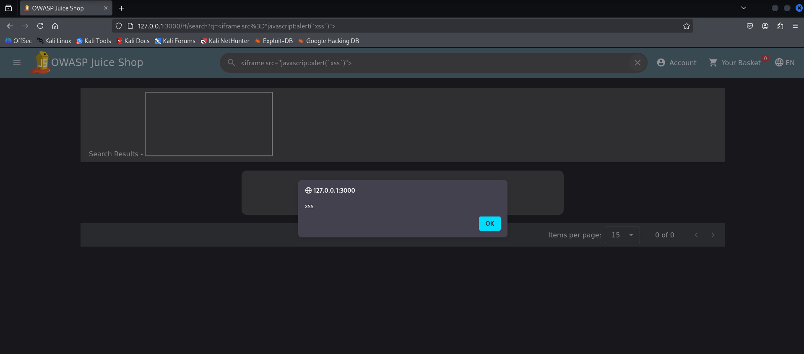
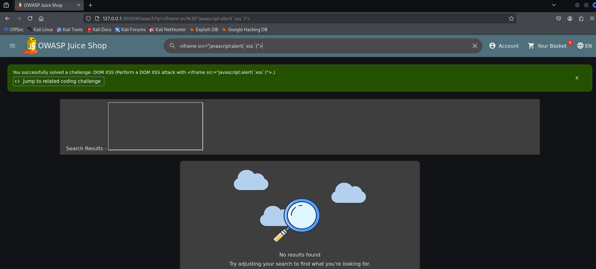

Bonus payload 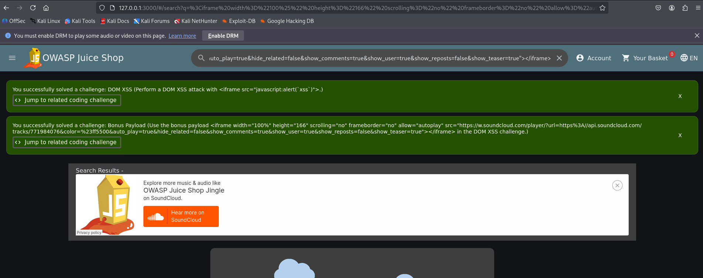
`<iframe width="100%" height="166" scrolling="no" frameborder="no" allow="autoplay" src="https://w.soundcloud.com/player/?url=https%3A//api.soundcloud.com/tracks/771984076&color=%23ff5500&auto_play=true&hide_related=false&show_comments=true&show_user=true&show_reposts=false&show_teaser=true"></iframe>`

Витік конфіденційних даних
Спочатку шукаємо відкриті директорії, але отримуємо помилку: 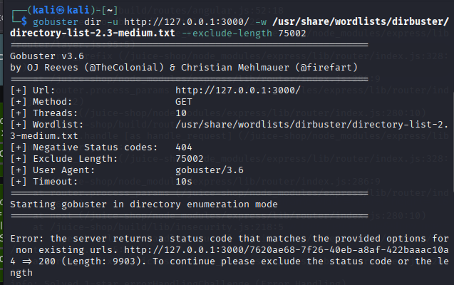

Вносимо зміни, які нам рекомендовано, та знову запускаємо сканування 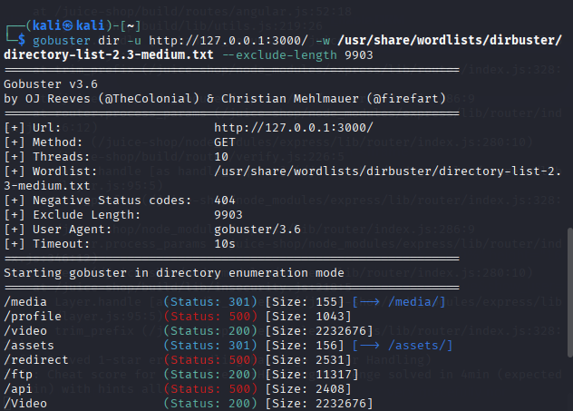

**Error Handling** пройдено 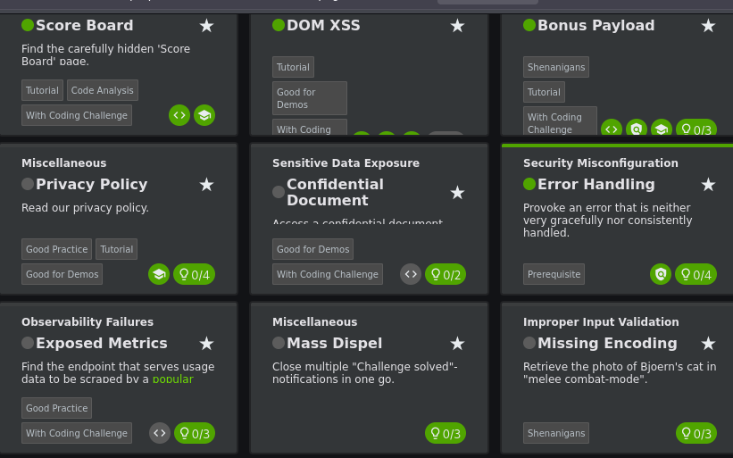

Переходимо за посиланням `http://localhost:3000/ftp` і бачимо декілька файлів 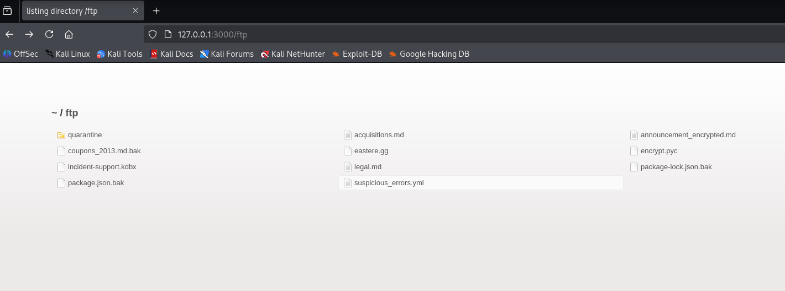

Пробуємо відкрити `suspicious_errors.yml` і бачимо помилку 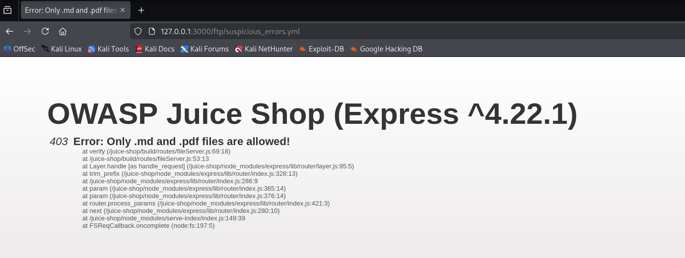

Добавляємо %2500.md після .yml 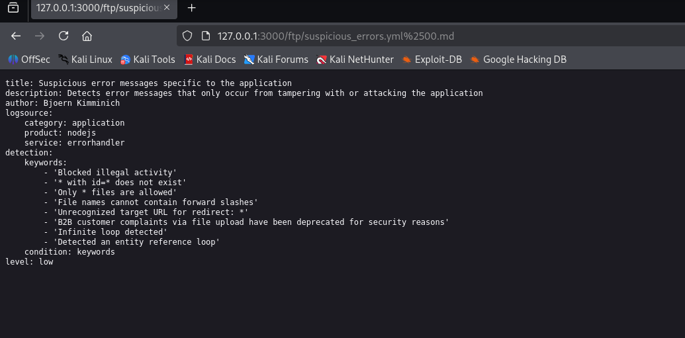

Як результат - пройшли ще кілька завдань 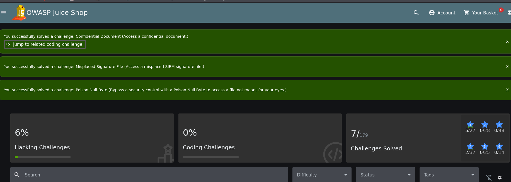

## Злам акаунтів (Authentication)
Переходимо на сторінку Login
Вводимо у поле Email: `' or 1=1--` і будь-який пароль.

Завдання пройдено! 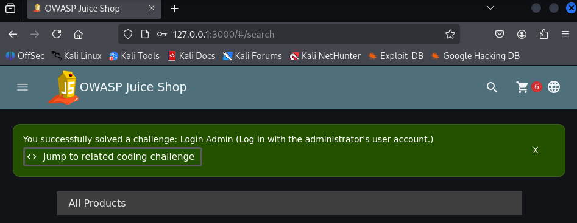

## Додаткове завдання (Exposed Metrics)

**Опис**: Find the endpoint that serves usage data to be scraped by a popular monitoring system.

Найпопулярнішою системою збору метрик є prometheus.

Переходимо по /metrics 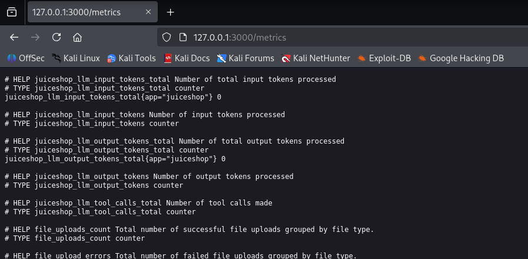
Завдання пройдено! 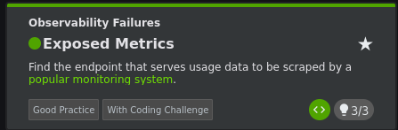
