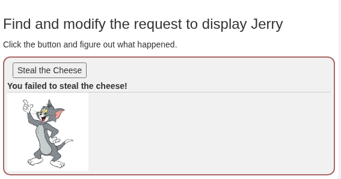
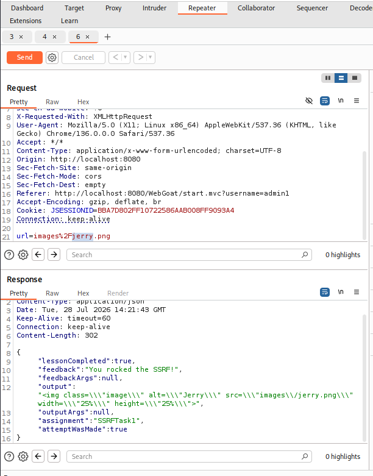
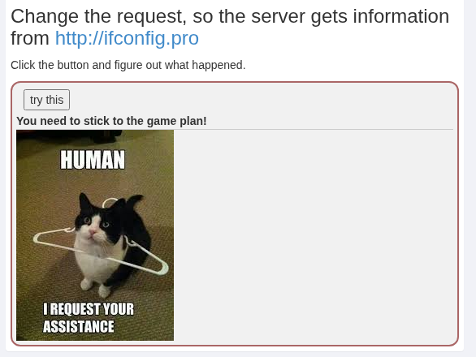
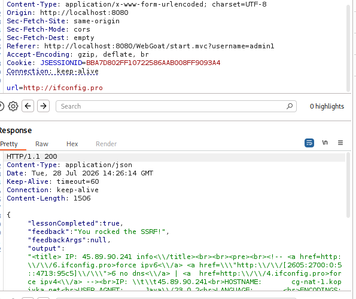

## WebGoat: Server-Side Request Forgery

Клікаємо кнопку з включеним burpsuit proxy 

Переносимо запит в Repeater та міняємо параметр `url` з tom на jerry 

Кнопка "try this" міняє параметр url елемента img

Змінюємо параметр `url` з cat.jpg на ifconfig.pro 

Завдання пройдено!